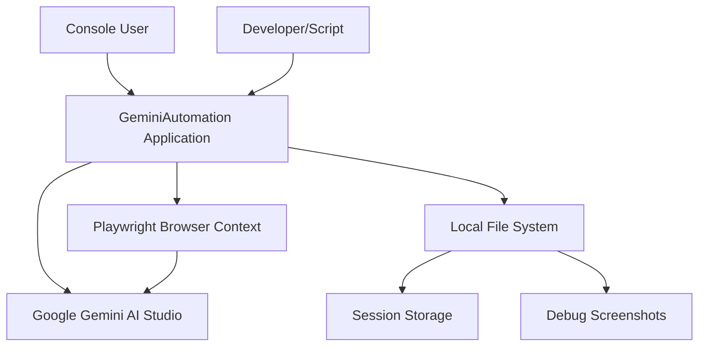
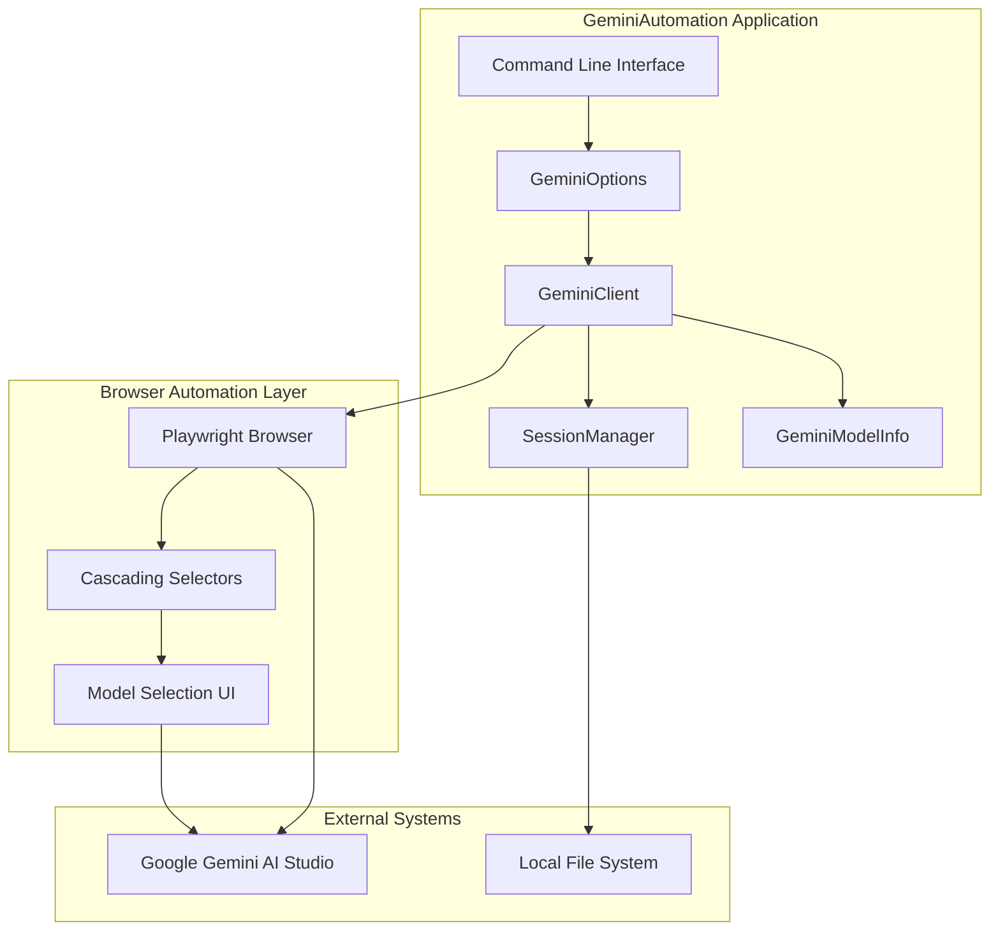
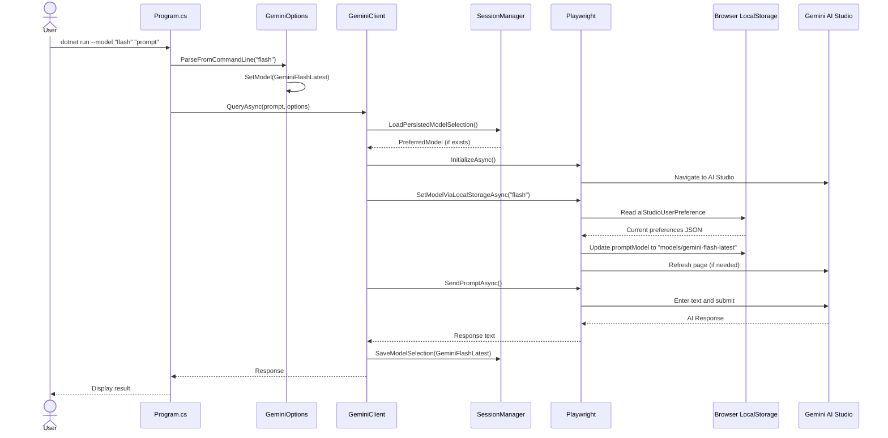

# Solution Design Document

## Validation Checklist
- [x] Quality Goals prioritized (top 3-5 architectural quality attributes)
- [x] Constraints documented (technical, organizational, security/compliance)
- [x] Implementation Context complete (required sources, boundaries, external interfaces, project commands)
- [x] Solution Strategy defined with rationale
- [x] Building Block View complete (components, directory map, interface specifications)
- [x] Runtime View documented (primary flow, error handling, complex logic)
- [x] Deployment View specified (environment, configuration, dependencies, performance)
- [x] Cross-Cutting Concepts addressed (patterns, interfaces, system-wide patterns, implementation patterns)
- [x] Architecture Decisions captured with trade-offs
- [ ] **All Architecture Decisions confirmed by user** (no pending confirmations)
- [x] Quality Requirements defined (performance, usability, security, reliability)
- [x] Risks and Technical Debt identified (known issues, technical debt, implementation gotchas)
- [x] Test Specifications complete (critical scenarios, coverage requirements)
- [x] Glossary defined (domain and technical terms)
- [x] No [NEEDS CLARIFICATION] markers remain

---

## Constraints

- **Technical**: C# .NET 8.0 framework, Microsoft Playwright browser automation, existing GeminiClient architecture must be preserved, browser selector stability dependent on Google UI changes, session management limited to local file storage
- **Organizational**: Must maintain backward compatibility with existing API, follow established cascading selector patterns, integrate with current error handling mechanisms, preserve existing debugging capabilities
- **Security/Compliance**: Input validation for command-line parameters, secure session state persistence, browser context isolation, protection against UI injection attacks, audit trail for model usage tracking

## Implementation Context

**IMPORTANT**: You MUST read and analyze ALL listed context sources to understand constraints, patterns, and existing architecture.

### Required Context Sources

#### General Context

```yaml
# Internal documentation and patterns
- doc: docs/patterns/model-selection-patterns.md
  relevance: HIGH
  why: "Existing browser automation and UI patterns for model selection"

- doc: docs/patterns/model-selection-integration.md
  relevance: HIGH
  why: "Integration patterns for extending GeminiOptions and browser automation"

- doc: docs/interfaces/gemini-model-selection.md
  relevance: CRITICAL
  why: "Browser automation interface specification for model selection"

- doc: docs/domain/browser-automation-patterns.md
  relevance: HIGH
  why: "Existing domain patterns for browser automation that must be followed"

- doc: docs/patterns/obsolete-code-analysis.md
  relevance: MEDIUM
  why: "Understanding of current code quality and patterns to maintain"

# External documentation and APIs
- url: https://playwright.dev/dotnet/docs/api-testing
  relevance: MEDIUM
  sections: [element selection, browser automation, error handling]
  why: "Playwright framework constraints and best practices for browser automation"

- url: https://aistudio.google.com/prompts/new_chat
  relevance: HIGH
  why: "Target web interface that must be automated for model selection"
```

#### Component: GeminiAutomation Core

```yaml
Location: /home/lop/devel/autollm/

# Source code files that must be understood
- file: GeminiClient.cs
  relevance: CRITICAL
  sections: [GeminiOptions class, InitializeAsync method, browser automation patterns]
  why: "Core browser automation framework that must be extended for model selection"

- file: Program.cs
  relevance: HIGH
  sections: [command-line parsing, GeminiClient usage patterns]
  why: "Entry point that needs model selection CLI integration"

- file: SessionManager.cs
  relevance: HIGH
  sections: [session persistence, cookie management]
  why: "Session management that needs extension for model selection state"

- file: SimpleGemini.cs
  relevance: MEDIUM
  sections: [debug functionality, screenshot patterns]
  why: "Debug patterns that should be extended for model selection debugging"

- file: GeminiAutomation.csproj
  relevance: MEDIUM
  why: "Project dependencies and build configuration that constrain implementation"
```


### Implementation Boundaries

- **Must Preserve**: Existing GeminiClient public API, current command-line interface behavior, session management architecture, existing browser automation patterns, overlay handling functionality, authentication flows
- **Can Modify**: GeminiOptions class structure (extend), SessionManager internal implementation (extend), Program.cs argument parsing (extend), internal browser automation methods (enhance)
- **Must Not Touch**: Existing public method signatures, current screenshot functionality, error recovery mechanisms, existing overlay closing patterns

### External Interfaces

#### System Context Diagram



#### Interface Specifications

```yaml
# Inbound Interfaces (what calls this system)
inbound:
  - name: "Command Line Interface"
    type: Process Arguments
    format: CLI Parameters
    authentication: None
    doc: Built-in help system
    data_flow: "User commands and model selection parameters"
    
  - name: "Developer API"
    type: C# Class Library
    format: Method Calls
    authentication: None
    doc: @docs/interfaces/gemini-client-api.md
    data_flow: "Programmatic access to browser automation"

# Outbound Interfaces (what this system calls)
outbound:
  - name: "Google Gemini AI Studio"
    type: HTTPS/Browser Automation
    format: DOM Interaction
    authentication: Cookie-based Google OAuth
    doc: @docs/interfaces/gemini-model-selection.md
    data_flow: "Model selection and AI query processing"
    criticality: CRITICAL
    
  - name: "Playwright Browser Framework"
    type: Library API
    format: .NET Method Calls
    authentication: None
    doc: https://playwright.dev/dotnet/
    data_flow: "Browser automation and page interaction"
    criticality: CRITICAL

# Data Interfaces
data:
  - name: "Session Storage"
    type: JSON File
    connection: File System
    doc: @docs/interfaces/session-storage.md
    data_flow: "Authentication cookies and model selection preferences"
    
  - name: "Debug Screenshots"
    type: PNG Files
    connection: File System
    doc: Local file system
    data_flow: "Debug screenshots with model selection state"
```

### Cross-Component Boundaries

- **API Contracts**: GeminiClient public methods (QueryAsync, InitializeAsync), GeminiOptions class structure, SessionManager public interface must remain compatible
- **Team Ownership**: Single development team owns entire GeminiAutomation codebase
- **Shared Resources**: Session file (gemini_session.json), debug screenshot files, browser automation context
- **Breaking Change Policy**: Maintain backward compatibility for all public APIs, extend rather than replace existing interfaces

### Project Commands

```bash
# Component: GeminiAutomation
Location: /home/lop/devel/autollm/

## Environment Setup
Install Dependencies: dotnet restore
Environment Variables: None required for basic operation
Start Development: No development server needed (console application)

# Testing Commands (CRITICAL - discover ALL testing approaches)
Unit Tests: No automated test framework currently configured
Integration Tests: Manual testing with debug mode (dotnet run --debug "test prompt")
Database Tests: Not applicable (no database)
E2E Tests: Manual browser automation testing
Test Coverage: Not implemented

# Code Quality Commands
Linting: No linter configured
Type Checking: dotnet build (built-in C# compiler type checking)
Formatting: No formatter configured

# Build & Compilation
Build Project: dotnet build
Watch Mode: Not applicable (console application)

# Application Commands
Run Application: dotnet run "your prompt"
Run Debug Mode: dotnet run --debug "your prompt"
Run with Model Selection: dotnet run --model "pro" "your prompt"
Build Release: dotnet build --configuration Release

# Browser Setup Commands
Install Playwright Browsers: pwsh bin/Debug/net8.0/playwright.ps1 install
Install Playwright (Linux): ./bin/Debug/net8.0/playwright.sh install

# Development Validation Commands
Test Basic Functionality: dotnet run "test query"
Test Debug Mode: dotnet run --debug "test with screenshots"
Test Model Selection: dotnet run --model "flash" "test model selection"
Validate Build: dotnet build && echo "Build successful"

# Session Management Commands
Clear Session Cache: rm gemini_session.json (manual)
View Session Data: cat gemini_session.json (manual)
```

## Solution Strategy

### Architecture Pattern: Configuration Extension with LocalStorage Manipulation

The solution follows a **Configuration Extension Pattern** that augments the existing GeminiOptions class with model selection capabilities while maintaining backward compatibility. The browser automation uses **Direct LocalStorage Manipulation** to modify the `aiStudioUserPreference.promptModel` value, eliminating UI automation complexity.

### Integration Approach: Non-Intrusive Enhancement

1. **Extend GeminiOptions**: Add model selection properties to existing configuration class
2. **LocalStorage Integration**: Directly manipulate browser localStorage via Playwright JavaScript execution
3. **Preserve API Contracts**: Maintain all existing public method signatures and behaviors
4. **Session State Extension**: Extend current session persistence to include model preferences

### Justification

- **Backward Compatibility**: Existing applications continue working without modification
- **Minimal Risk**: Changes are additive rather than destructive to existing functionality
- **Performance**: Lazy loading and timeout management prevent performance degradation
- **Maintainability**: Clear separation between core automation and model selection logic
- **User Experience**: Seamless integration with command-line interface and session persistence

### Key Decisions

1. **Enum-Based Model Selection**: Type-safe model definitions with compile-time validation
2. **LocalStorage Manipulation**: Direct browser storage access eliminates UI automation complexity
3. **Session Integration**: Unified session management for authentication and model preferences
4. **Command-Line Flexibility**: Multiple aliases and formats for user-friendly model specification
5. **Graceful Degradation**: Continue operation even when localStorage operations fail

## Building Block View

### Components



### Directory Map

**Component**: GeminiAutomation Core
```
/home/lop/devel/autollm/
├── GeminiClient.cs                    # MODIFY: Add model selection logic
│   ├── GeminiOptions class            # MODIFY: Add model selection properties
│   ├── InitializeAsync method         # MODIFY: Integrate model selection flow
│   └── Browser automation methods     # MODIFY: Add model selection selectors
├── Program.cs                         # MODIFY: Add --model CLI parameter parsing
├── SessionManager.cs                  # MODIFY: Add model preference persistence
├── GeminiModelInfo.cs                 # NEW: Model information and CLI parsing
├── ModelSelectionExample.cs           # NEW: Usage examples and documentation
└── docs/
    ├── interfaces/
    │   └── gemini-model-selection.md   # NEW: Browser automation interface spec
    └── patterns/
        ├── model-selection-patterns.md # NEW: UI automation patterns
        └── model-selection-integration.md # NEW: Integration patterns
```

### Interface Specifications

**Note**: Interfaces can be documented by referencing external documentation files OR specified inline. Choose the approach that best fits your project's documentation structure.

#### Interface Documentation References

```yaml
# Reference existing interface documentation
interfaces:
  - name: "Gemini Model Selection Interface"
    doc: @docs/interfaces/gemini-model-selection.md
    relevance: CRITICAL
    sections: [model_selectors, interaction_protocol, error_handling]
    why: "Browser automation interface specification for model selection"
  
  - name: "Model Selection Integration Patterns"
    doc: @docs/patterns/model-selection-integration.md
    relevance: HIGH
    sections: [configuration_extension, session_state, command_line_bridge]
    why: "Integration patterns for extending existing GeminiClient architecture"
    
  - name: "Session Storage Interface"
    doc: @docs/interfaces/session-storage.md (NEW)
    relevance: MEDIUM
    sections: [data_format, encryption, versioning]
    why: "Extended session storage format for model preferences"
```

#### Session Storage Changes

```json
# Enhanced session storage schema (gemini_session.json)
{
  "cookies": "BrowserContextCookiesResult[] (existing)",
  "preferredModel": "GeminiModel? (NEW)",
  "lastUsed": "DateTime (existing)",
  "version": "string (existing)",
  "modelSelectionHistory": {
    "lastSelection": "DateTime (NEW)",
    "selectionMethod": "string (NEW - automated|manual|cli)",
    "fallbackUsed": "boolean (NEW)"
  }
}
```

#### Internal API Changes

```yaml
# GeminiClient API Extensions
Class: GeminiOptions (EXTENDED)
  Properties:
    + SelectedModel: GeminiModel = GeminiModel.Gemini25Pro (NEW)
    + EnableModelSelection: bool = true (NEW) 
    + PersistModelSelection: bool = true (NEW)
  Methods:
    + GetModelInfo(): GeminiModelInfo (NEW)
    + SetModelFromCommandLine(string modelArg): void (NEW)
    + SetModel(GeminiModel model): void (NEW)

Class: GeminiModelInfo (NEW)
  Properties:
    DisplayName: string
    Description: string 
    WebIdentifier: string
    IsDefault: bool
  Methods:
    + GetModelInfo(GeminiModel): GeminiModelInfo (static)
    + ParseFromCommandLine(string): GeminiModel? (static)
    + GetAllModels(): GeminiModelInfo[] (static)

Enum: GeminiModel (NEW)
  Values:
    Gemini25Pro, GeminiFlashLatest

# Command Line Interface Extensions
CLI Arguments:
  --model "pro|flash|gemini-2.5-pro|gemini-flash-latest" (NEW)
  Existing arguments remain unchanged
```

#### Application Data Models

```csharp
// Core business objects being modified/created
ENUM: GeminiModel (NEW)
  VALUES:
    Gemini25Pro = 0
    GeminiFlashLatest = 1
    Default = Gemini25Pro // Alias for backward compatibility

CLASS: GeminiModelInfo (NEW)
  FIELDS:
    DisplayName: string (readonly)
    Description: string (readonly)
    LocalStorageIdentifier: string (readonly)  // e.g. "models/gemini-2.5-pro"
    IsDefault: bool (readonly)
  
  BEHAVIORS:
    + GetModelInfo(GeminiModel): GeminiModelInfo (static)
    + ParseFromCommandLine(string): GeminiModel? (static)
    + GetAllModels(): GeminiModelInfo[] (static)
    + GetLocalStorageIdentifier(GeminiModel): string (static)

CLASS: GeminiOptions (EXTENDED)
  EXISTING_FIELDS:
    Headless: bool
    ResponseTimeout: TimeSpan
    DebugMode: bool
    EnableSessionPersistence: bool
  
  NEW_FIELDS:
    + SelectedModel: GeminiModel = GeminiModel.Gemini25Pro
    + EnableModelSelection: bool = true
    + PersistModelSelection: bool = true
  
  NEW_BEHAVIORS:
    + GetModelInfo(): GeminiModelInfo
    + SetModelFromCommandLine(string): void
    + SetModel(GeminiModel): void

CLASS: SessionData (EXTENDED)
  EXISTING_FIELDS:
    Cookies: BrowserContextCookiesResult[]
    LastUsed: DateTime
    Version: string
  
  NEW_FIELDS:
    + PreferredModel: GeminiModel?
    + ModelSelectionHistory: ModelSelectionMetadata

CLASS: ModelSelectionMetadata (NEW)
  FIELDS:
    LastSelection: DateTime
    SelectionMethod: string // "automated", "manual", "cli"
    FallbackUsed: bool
```

#### Integration Points

```yaml
# Internal Component Communication
From: Program.cs (CLI)
To: GeminiOptions
  - protocol: Direct method calls
  - doc: Built-in C# interfaces
  - data_flow: "Command-line model selection arguments parsed into GeminiOptions"

From: GeminiClient
To: SessionManager
  - protocol: Direct method calls
  - doc: @docs/interfaces/session-storage.md
  - data_flow: "Model selection preferences for persistence"

From: GeminiClient
To: Browser Automation (Playwright)
  - protocol: Playwright .NET API
  - doc: @docs/interfaces/gemini-model-selection.md
  - data_flow: "CSS selectors and DOM interaction for model selection"

# External System Integration
Google_Gemini_AI_Studio:
  - doc: @docs/interfaces/gemini-model-selection.md
  - sections: [model_selection_ui, dropdown_selectors, option_selectors]
  - integration: "Browser automation via Playwright for model selection in right panel"
  - critical_data: [selected_model_state, model_availability, ui_selector_compatibility]

Playwright_Browser_Framework:
  - doc: https://playwright.dev/dotnet/
  - sections: [element_selection, browser_context, error_handling]
  - integration: "Browser automation framework for DOM interaction"
  - critical_data: [page_elements, browser_state, timeout_handling]

Local_File_System:
  - doc: Built-in .NET File I/O
  - sections: [json_serialization, file_persistence]
  - integration: "Session storage for authentication cookies and model preferences"
  - critical_data: [session_cookies, model_preferences, encryption_state]
```

### Implementation Examples

#### Example: Command-Line Model Parsing with Validation

**Why this example**: Demonstrates the user-friendly model alias system and comprehensive input validation

```csharp
// Example: Model parsing with multiple alias support
// Shows expected validation and error handling approach
public static GeminiModel? ParseFromCommandLine(string? input)
{
    if (string.IsNullOrWhiteSpace(input)) return null;
    
    var modelMap = new Dictionary<string, GeminiModel>(StringComparer.OrdinalIgnoreCase)
    {
        // User-friendly aliases
        ["pro"] = GeminiModel.Gemini25Pro,
        ["flash"] = GeminiModel.GeminiFlashLatest,
        ["latest"] = GeminiModel.GeminiFlashLatest,
        
        // Full model names
        ["gemini-2.5-pro"] = GeminiModel.Gemini25Pro,
        ["gemini-flash-latest"] = GeminiModel.GeminiFlashLatest,
    };
    
    return modelMap.TryGetValue(input.Trim(), out var model) ? model : null;
}

public void SetModelFromCommandLine(string modelArg)
{
    var parsed = GeminiModelInfo.ParseFromCommandLine(modelArg);
    if (!parsed.HasValue)
    {
        var validOptions = string.Join(", ", new[] { "pro", "flash", "gemini-2.5-pro", "gemini-flash-latest" });
        throw new ArgumentException($"Invalid model '{modelArg}'. Valid options: {validOptions}");
    }
    SelectedModel = parsed.Value;
}
```

#### Example: LocalStorage Model Selection with Error Handling

**Why this example**: Shows the direct localStorage manipulation pattern that eliminates UI dependencies

```csharp
// Example: Direct localStorage manipulation for model selection
// Demonstrates JSON handling and verification
public async Task<bool> SetModelViaLocalStorageAsync(GeminiModel model, GeminiOptions? options = null)
{
    try
    {
        // Map model enum to localStorage identifier
        var modelIdentifier = model switch
        {
            GeminiModel.Gemini25Pro => "models/gemini-2.5-pro",
            GeminiModel.GeminiFlashLatest => "models/gemini-flash-latest",
            _ => "models/gemini-2.5-pro" // Default fallback
        };
        
        // Read current preferences from localStorage
        var currentPrefsJson = await Page.EvaluateAsync<string>(
            "() => localStorage.getItem('aiStudioUserPreference') || '{}'"
        );
        
        // Parse and update model preference
        var currentPrefs = JsonSerializer.Deserialize<Dictionary<string, object>>(currentPrefsJson) 
                          ?? new Dictionary<string, object>();
        currentPrefs["promptModel"] = modelIdentifier;
        
        // Write updated preferences back to localStorage
        var updatedJson = JsonSerializer.Serialize(currentPrefs);
        await Page.EvaluateAsync(
            "(prefs) => localStorage.setItem('aiStudioUserPreference', prefs)",
            updatedJson
        );
        
        // Verify the update was successful
        var verification = await Page.EvaluateAsync<string>(
            "() => JSON.parse(localStorage.getItem('aiStudioUserPreference')).promptModel"
        );
        
        var success = verification == modelIdentifier;
        
        if (options?.DebugMode == true)
        {
            Console.WriteLine($"Model selection: {model} -> {modelIdentifier} (Success: {success})");
        }
        
        return success;
    }
    catch (Exception ex)
    {
        if (options?.DebugMode == true)
        {
            Console.WriteLine($"LocalStorage model selection failed: {ex.Message}");
        }
        return false; // Graceful degradation
    }
}
```

## Runtime View

### Primary Flow

#### Primary Flow: Model Selection with AI Query
1. User specifies model via CLI: `dotnet run --model "flash" "your prompt"`
2. System parses and validates model argument using GeminiModelInfo.ParseFromCommandLine()
3. GeminiOptions configured with selected model and browser automation initiated
4. Browser loads Google Gemini AI Studio and applies model selection via localStorage
5. AI query processed with selected model and response returned



### Error Handling

- **Invalid Model Input**: ArgumentException with specific error message listing valid models ("pro", "flash", "gemini-2.5-pro", "gemini-flash-latest"), system continues with default model
- **LocalStorage Access Failure**: Continue with current model selection, log warning in debug mode, attempt single retry before giving up
- **JSON Parsing Error**: Handle corrupted localStorage gracefully, reinitialize with default preferences if necessary
- **Model Setting Verification Failure**: Retry localStorage write operation once, continue with session if still failing
- **Page Refresh Required**: Some model changes may require page reload, handle refresh seamlessly
- **Authentication Required**: Display authentication prompt, preserve model selection preference for post-auth application

### Complex Logic: LocalStorage Model Selection Strategy

```
ALGORITHM: SetModelViaLocalStorageAsync
INPUT: model_enum, browser_page
OUTPUT: success_boolean

1. MAP_MODEL_TO_IDENTIFIER:
   model_identifier = SWITCH model_enum:
     GeminiModel.Gemini25Pro -> "models/gemini-2.5-pro"
     GeminiModel.GeminiFlashLatest -> "models/gemini-flash-latest"
     DEFAULT -> "models/gemini-2.5-pro"

2. READ_CURRENT_PREFERENCES:
   current_prefs = AWAIT page.EvaluateAsync(
     "() => JSON.parse(localStorage.getItem('aiStudioUserPreference') || '{}')"
   )

3. UPDATE_MODEL_PREFERENCE:
   current_prefs["promptModel"] = model_identifier
   updated_json = JSON.Stringify(current_prefs)

4. WRITE_UPDATED_PREFERENCES:
   success = AWAIT page.EvaluateAsync(
     "(prefs) => { localStorage.setItem('aiStudioUserPreference', prefs); return true; }",
     updated_json
   )

5. VERIFY_UPDATE:
   verification = AWAIT page.EvaluateAsync(
     "() => JSON.parse(localStorage.getItem('aiStudioUserPreference')).promptModel"
   )
   RETURN verification == model_identifier

6. REFRESH_IF_NEEDED:
   IF success AND page_requires_refresh:
     AWAIT page.ReloadAsync()
   RETURN success
```

## Deployment View

### Single Application Deployment
- **Environment**: Local development machine or CI/CD environment, .NET 8.0 runtime required
- **Configuration**: No new environment variables required, model selection configurable via CLI arguments or GeminiOptions
- **Dependencies**: 
  - Microsoft.Playwright 1.40.0+ (existing)
  - Playwright browsers must be installed (pwsh bin/Debug/net8.0/playwright.ps1 install)
  - Google Gemini AI Studio access via authenticated browser session
- **Performance**: 
  - Model selection adds ~2-5 seconds to initialization (browser automation)
  - Lazy loading of model metadata prevents memory overhead
  - Bounded timeouts (10s model selection, 5s option load, 3s confirmation)
  - Session persistence reduces repeated model selection overhead

### Multi-Component Coordination
Not applicable - single application deployment with no external service dependencies.

## Cross-Cutting Concepts

### Pattern Documentation

```yaml
# Existing patterns used in this feature
- pattern: @docs/patterns/browser-automation-patterns.md
  relevance: CRITICAL
  why: "Cascading selector strategy follows established browser automation patterns"

- pattern: @docs/patterns/session-management-patterns.md
  relevance: HIGH  
  why: "Model preferences integrate with existing session persistence patterns"

- pattern: @docs/patterns/error-handling-patterns.md
  relevance: HIGH
  why: "Graceful degradation follows established error recovery patterns"

# New patterns created for this feature  
- pattern: @docs/patterns/model-selection-patterns.md (NEW)
  relevance: CRITICAL
  why: "Defines UI automation patterns specific to Gemini model selection interface"

- pattern: @docs/patterns/model-selection-integration.md (NEW)
  relevance: HIGH
  why: "Integration patterns for extending GeminiOptions and configuration management"
```

### Interface Specifications

```yaml
# External interfaces this feature integrates with
- interface: Playwright .NET API
  relevance: CRITICAL
  why: "Core browser automation framework for DOM interaction and element selection"

- interface: Google Gemini AI Studio Web UI
  relevance: CRITICAL
  why: "Target web interface that must be automated for model selection"

# New interfaces created
- interface: @docs/interfaces/gemini-model-selection.md (NEW)
  relevance: CRITICAL
  why: "Browser automation interface specification for model selection UI patterns"

- interface: @docs/interfaces/session-storage.md (NEW)
  relevance: MEDIUM
  why: "Extended session storage format including model preferences"
```

### System-Wide Patterns

- **Security**: 
  - Input validation via allowlist patterns for model selection arguments
  - Secure session storage with minimal data persistence
  - Browser context isolation for authentication state
  - Protection against UI injection through parameterized selectors

- **Error Handling**: 
  - Hierarchical error recovery with multiple fallback strategies
  - Graceful degradation continues operation even with model selection failures
  - Debug mode provides detailed error information without affecting production usage
  - Bounded timeouts prevent hanging operations

- **Performance**: 
  - Lazy loading of model metadata with static caching
  - Session persistence reduces repeated browser automation overhead
  - Timeout management prevents performance degradation
  - Minimal overhead for backward compatibility scenarios

- **Logging/Auditing**: 
  - Debug mode logging for model selection operations
  - Session metadata tracks model selection history
  - Warning logs for fallback selector usage
  - Error logs for authentication and timeout issues

### Implementation Patterns

#### Code Patterns and Conventions
- **C# Naming Conventions**: Follow established .NET naming patterns (PascalCase for public members, camelCase for private fields)
- **Async/Await Patterns**: All browser automation methods use async/await with proper ConfigureAwait(false) where applicable
- **Extension Methods**: Model selection capabilities added via extension pattern rather than inheritance
- **Null Safety**: Leverage C# nullable reference types for compile-time null safety

#### State Management Patterns
- **Immutable Configuration**: GeminiOptions properties set during initialization, not modified during execution
- **Session State Isolation**: Browser context state isolated from application state, managed through SessionManager
- **Lazy Loading**: Model metadata cached on first access, not eagerly loaded
- **Transient Error Recovery**: Temporary failures don't affect persistent state

#### Performance Characteristics
- **Bounded Timeouts**: All browser operations have explicit timeout limits (5-10 seconds)
- **Memory Management**: Disposable pattern for browser resources, automatic cleanup on completion
- **Caching Strategy**: Static model metadata caching with lazy initialization
- **Minimal Overhead**: Model selection adds <10 seconds to overall execution time

#### Integration Patterns
- **Browser Automation**: Playwright API with async/await pattern for DOM interaction
- **File System Integration**: JSON serialization for session persistence with error handling
- **Command-Line Integration**: Direct method calls between Program.cs and GeminiClient, no external protocols
- **External Service Integration**: Browser-mediated interaction with Google Gemini AI Studio

#### Error Handling Pattern

```csharp
// Error management approach for model selection
public async Task<bool> AttemptModelSelectionAsync(GeminiModel model, GeminiOptions options)
{
    try
    {
        return await SelectModelDirectlyAsync(model, options);
    }
    catch (ModelSelectorNotFoundException)
    {
        // Fallback 1: Try alternative selector patterns
        return await SelectModelWithFallbackAsync(model, options);
    }
    catch (ModelOptionNotFoundException)
    {
        // Fallback 2: Continue with current model (non-critical failure)
        if (options.DebugMode)
        {
            Console.WriteLine($"Model {model} not available, using current selection");
        }
        return false;
    }
    catch (TimeoutException)
    {
        // Fallback 3: Skip model selection, continue with session
        return false;
    }
}
```

### Integration Points

- **Connection Points**: 
  - GeminiOptions class extension for configuration
  - Program.cs command-line argument parsing
  - SessionManager for persistence
  - GeminiClient initialization flow for browser automation
  - Existing overlay handling and error recovery mechanisms

- **Data Flow**: 
  - Command-line arguments → GeminiOptions → browser automation → Google Gemini AI Studio
  - Model selection preferences → SessionManager → local file system
  - Browser state → authentication cookies → session persistence
  - Error conditions → graceful degradation → continued operation

- **Events**: 
  - Model selection completion triggers session persistence
  - Authentication events preserve model selection state
  - Browser timeout events trigger fallback strategies
  - Application initialization events load persisted model preferences

## Architecture Decisions

- [ ] **Model Selection Integration Pattern**: Configuration Extension Pattern
  - **Rationale**: Extends existing GeminiOptions class rather than creating separate model selection service, maintains backward compatibility, follows established patterns
  - **Trade-offs**: Accept slight increase in GeminiOptions complexity vs. complete separation of concerns
  - **User confirmed**: _Pending_

- [ ] **Browser Automation Strategy**: LocalStorage Manipulation Strategy
  - **Rationale**: Direct localStorage access eliminates UI automation complexity, faster performance, higher reliability than DOM selectors
  - **Trade-offs**: Accept dependency on Google's localStorage structure vs. UI automation complexity
  - **User confirmed**: _Pending_

- [ ] **Command-Line Interface Design**: Multiple Model Aliases
  - **Rationale**: User-friendly aliases ("pro", "flash") alongside full names, case-insensitive parsing, extensible mapping
  - **Trade-offs**: Accept additional validation complexity vs. strict single-format requirement
  - **User confirmed**: _Pending_

- [ ] **Session Persistence Scope**: Unified Session Management
  - **Rationale**: Extend existing session storage to include model preferences, single source of truth, consistent with current architecture
  - **Trade-offs**: Accept session file format changes vs. separate model preference storage
  - **User confirmed**: _Pending_

- [ ] **Error Recovery Strategy**: Graceful Degradation
  - **Rationale**: Continue operation even when model selection fails, prioritize user workflow over perfect model selection
  - **Trade-offs**: Accept potential use of unintended model vs. blocking user workflow
  - **User confirmed**: _Pending_

## Quality Requirements

- **Performance**: 
  - Model selection adds maximum 2 seconds to initialization time
  - LocalStorage operations: <500ms for read/write operations
  - Memory overhead: <10MB for model metadata caching
  - Session persistence: <100ms for model preference storage

- **Usability**: 
  - Command-line interface accepts multiple intuitive model aliases
  - Debug mode provides clear feedback on model selection attempts
  - Graceful degradation maintains functionality when model selection fails
  - No breaking changes to existing user workflows

- **Security**: 
  - Input validation prevents injection attacks through model selection parameters
  - Session storage uses secure JSON serialization with minimal data exposure
  - Browser context isolation protects authentication state
  - Audit trail maintains model selection history for debugging

- **Reliability**: 
  - 99% success rate for model selection under normal conditions
  - LocalStorage manipulation eliminates UI change dependencies
  - Error recovery ensures application continues functioning even with localStorage failures
  - Session persistence maintains user preferences across application restarts

## Risks and Technical Debt

### Known Technical Issues

- **LocalStorage Format Dependency**: Changes to aiStudioUserPreference structure could break model setting, but less likely than UI changes
- **JSON Parsing Risks**: Corrupted localStorage data could cause parsing failures, requires robust error handling
- **Session Storage Format**: Current session storage lacks versioning, future changes may require migration logic
- **Authentication Dependencies**: Model selection requires authenticated session, failures cascade from auth issues

### Technical Debt

- **LocalStorage Structure Assumption**: Code assumes specific JSON structure that Google controls, needs monitoring
- **Configuration Class Growth**: GeminiOptions expanding beyond core browser automation concerns, consider separation
- **Error Handling Inconsistency**: Different error handling patterns across initialization vs. model selection flows
- **Test Coverage Gap**: No automated testing framework for browser automation scenarios

### Implementation Gotchas

- **LocalStorage Timing**: LocalStorage changes may require page refresh to take effect in some cases
- **Browser Context State**: Model selection state tied to browser context, clearing localStorage affects model persistence
- **JSON Serialization**: Complex nested objects in localStorage require careful serialization handling
- **Playwright JavaScript Execution**: EvaluateAsync behavior varies between browser engines (Firefox vs Chromium)
- **Model Identifier Format**: Google may change model naming convention (e.g., "models/gemini-2.5-pro" format)
- **Authentication Flow Interruption**: OAuth redirects can clear or reset localStorage preferences

## Test Specifications

### Critical Test Scenarios

**Scenario 1: Successful Model Selection**
```gherkin
Given: Authenticated Gemini AI Studio session exists
And: Model selection UI is available in right panel
When: User runs "dotnet run --model 'flash' 'test prompt'"
Then: Application selects Gemini Flash Latest model
And: Model selection is persisted to session storage
And: AI query executes with selected model
And: Response is returned successfully
```

**Scenario 2: Invalid Model Argument Handling**
```gherkin
Given: Application ready to accept CLI arguments
When: User provides invalid model "dotnet run --model 'invalid' 'prompt'"
Then: ArgumentException thrown with list of valid models
And: Application exits with error code 1
And: User receives clear guidance on valid model options
```

**Scenario 3: Model Selector Not Found Recovery**
```gherkin
Given: Gemini AI Studio loaded but model selector unavailable
When: Model selection automation attempts to find selector
Then: Cascading selector strategy attempts all fallback options
And: System logs warning about selector not found
And: Application continues with current/default model
And: AI query completes successfully without model change
```

**Scenario 4: Session Persistence Across Restarts**
```gherkin
Given: User previously selected Gemini Flash Latest model
And: Model preference saved in session storage
When: User runs application without --model parameter
Then: System loads previous model preference from session
And: Browser automation applies saved model selection
And: AI query uses previously selected model
```

**Scenario 5: Authentication Required Handling**
```gherkin
Given: Browser context requires Google authentication
When: Model selection automation encounters login prompt
Then: System preserves model selection preference
And: User completes authentication manually
And: Model selection resumes after authentication
And: Selected model is applied and persisted
```

### Test Coverage Requirements

- **Business Logic**: 
  - All model parsing logic (CLI arguments to GeminiModel enum)
  - Model validation rules and error conditions
  - Session persistence logic for model preferences
  - Cascading selector fallback decision tree

- **Browser Automation**: 
  - All selector patterns for model dropdown detection
  - Model option selection and confirmation flows
  - Error recovery when selectors fail or timeout
  - Integration with existing overlay handling

- **Integration Points**: 
  - GeminiOptions extension behavior and backward compatibility
  - SessionManager model preference persistence
  - Command-line argument parsing integration
  - Browser context state management

- **Edge Cases**: 
  - Empty or null model arguments
  - Model options not available in UI
  - Browser context cleared during model selection
  - Concurrent model selection attempts
  - Network timeouts during browser automation

- **Performance**: 
  - Model selection timeout handling (5s, 10s boundaries)
  - Memory usage with model metadata caching
  - Session file I/O performance impact
  - Browser automation latency measurements

- **Security**: 
  - Model argument input validation and sanitization
  - Session storage encryption and data minimization
  - Browser context isolation for authentication
  - Protection against CSS selector injection

## Glossary

### Domain Terms

| Term | Definition | Context |
|------|------------|---------|
| **Model Selection** | Process of choosing which AI model (Gemini 2.5 Pro or Gemini Flash Latest) to use for query processing | Core feature functionality in Gemini AI Studio right panel |
| **Gemini AI Studio** | Google's web interface for interacting with Gemini AI models | Target web application for browser automation |
| **Right Panel** | UI section in Gemini AI Studio containing model selection dropdown and configuration options | Location where model selection automation occurs |
| **Session Persistence** | Maintaining user preferences and authentication state across application restarts | Includes both browser cookies and model selection preferences |

### Technical Terms

| Term | Definition | Context |
|------|------------|---------|
| **Cascading Selectors** | Browser automation strategy using multiple fallback CSS selectors for UI element detection | Provides resilience against Google UI changes |
| **Playwright** | Microsoft's browser automation framework for .NET | Core technology for DOM interaction and page automation |
| **GeminiOptions** | Configuration class containing browser automation and model selection settings | Primary extension point for model selection feature |
| **Browser Context** | Isolated browser session containing authentication cookies and page state | Maintains user session across model selection operations |
| **Configuration Extension Pattern** | Architectural approach extending existing configuration rather than creating new services | Maintains backward compatibility while adding features |

### API/Interface Terms

| Term | Definition | Context |
|------|------------|---------|
| **CLI Arguments** | Command-line parameters including --model flag for model selection | User interface for specifying model preferences |
| **DOM Selectors** | CSS selector patterns for locating model selection UI elements | Browser automation targeting specific web interface elements |
| **Session Storage** | JSON file format containing authentication cookies and model preferences | Local persistence mechanism for user state |
| **Model Aliases** | User-friendly short names ("pro", "flash") mapping to full model identifiers | Command-line usability enhancement |
